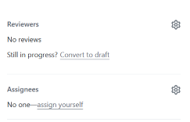

# How to edit documentation in a GitHub repository 

## Introduction

Many teams store their software documentation in repositories on GitHub. To make changes to the documentation, you need to edit the file and update the version stored in the repository. This page provides a quick overview of how to create a branch and commit your edits to the branch from the command line and how to open a pull request on GitHub.

## Before starting

To use Git from the command line, you first need to set up your local environment: 
- [Install Windows Subsystem for Linux (WSL)](https://learn.microsoft.com/en-us/windows/wsl/install). 
- [Set up the connection to Visual Studio Code (VS Code)](https://code.visualstudio.com/docs/setup/setup-overview). 
- [Clone the repository locally on your computer](https://docs.github.com/en/repositories/creating-and-managing-repositories/cloning-a-repository?tool=cli).

## Edit a GitHub repository from the command line

### Create a new branch
1. Open WSL and go to the folder where you cloned the repository. Then, open the repository:

```
cd <repository-name>
```

2. Switch to the main branch:

```
git switch main
```

3. Confirm you are working with the most up-to-date version of the repository:

```
git status
```

This command displays the branch you are currently on and lets you know if your local repository contains the most recent changes from the remote repository.

If you do not have the most recent changes, pull the changes into your local repository:

```
git pull
```

4. After confirming your repository is up to date, create a new branch to work from:

```
git switch -c <your-branch-name>
```

Give the branch a name that follows any naming conventions required by the development team.

### Commit changes

1. Open Visual Studio (VS) Code from the command line:

```
code .
```

Make any changes or edits to the file in VS Code, and save your work. 

2. After making your changes in VS Code, you can commit the changes to your branch with these two commands in order:

```
git add . 
git commit -m "Enter a message describing the changes"
```

The commit message should also follow any naming conventions required by the development team.

### Push changes

Before pushing your local changes to the team’s repository, make sure the changes you made do not conflict with any changes that might have been made while you were making your edits:

```
git pull 
```

If there are any conflicts between your local branch and the remote repository, follow the [instructions to resolve merge conflicts](https://docs.github.com/en/pull-requests/collaborating-with-pull-requests/addressing-merge-conflicts/resolving-a-merge-conflict-using-the-command-line).

If there are no conflicts, you can push your branch to the remote repository:

```
git push -u origin <your-branch-name>
```

### Open a pull request 

1. After pushing your branch from the command line, go to your team’s repository on the GitHub website, and you should see your pull request in a banner at the top. Click **Compare & pull request**.
   


2. Leave a clear description of the changes you made as well as a title for the pull request. Click **Create pull request**.
   
 


3. Select the appropriate reviewers to approve your changes.
   


4. Once approved, you can merge your branch into the repository. Your changes will now show up in the team’s repository.

## Troubleshooting

More information about creating a branch, committing changes, and opening  a pull request can be found in the [GitHub documentation](https://docs.github.com/en/pull-requests). 
